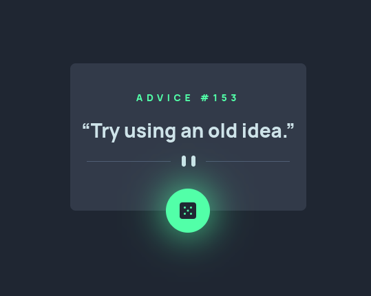

# Frontend Mentor - Advice generator app solution

This is a solution to the [Advice generator app challenge on Frontend Mentor](https://www.frontendmentor.io/challenges/advice-generator-app-QdUG-13db). Frontend Mentor challenges help you improve your coding skills by building realistic projects.

## Table of contents

- [Overview](#overview)
  - [The challenge](#the-challenge)
  - [Screenshot](#screenshot)
  - [Links](#links)
- [My process](#my-process)
  - [Built with](#built-with)
- [Author](#author)

## Overview

### The challenge

Users should be able to:

- View the optimal layout for the app depending on their device's screen size
- See hover states for all interactive elements on the page
- Generate a new piece of advice by clicking the dice icon

### Screenshot

### Links

- Solution URL: [GitHub](https://github.com/israelss/advice-generator)
- Live Site URL: [Vercel Deploy](https://advice-generator-israelss.vercel.app/)

## My process

### Built with

- Mobile-first workflow
- [React](https://reactjs.org/) - JS library
- React Custom Hook
- [Typescript](https://www.typescriptlang.org/)
- [Vite](https://vitejs.dev/) - Next Generation Frontend Tooling
- [Tailwind Css](https://tailwindcss.com/) - CSS Framework

## Author

- GitHub - [Israel Sant'Anna (@israelss)](https://github.com/israelss)
- LinkedIn - [Israel Sant'Anna (@israelss)](https://www.linkedin.com/in/israelss/)
- Frontend Mentor - [@israelss](https://www.frontendmentor.io/profile/israelss)
